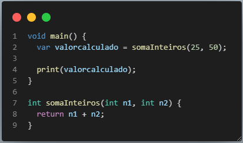
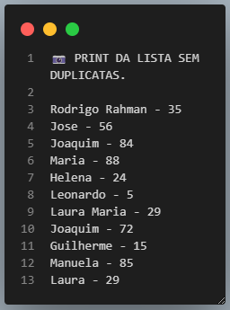
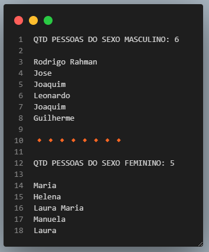
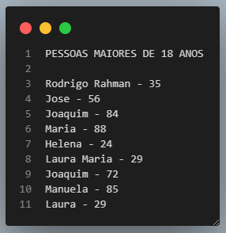
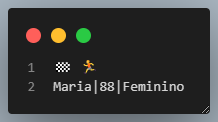

<h1 align="center">ATIVIDADES DESENVOLVIDAS NO CURSO DA ACADEMIA DO FLUTTER</h1>

<p align="center"> MÓDULO FUNÇÕES E COLEÇÕES.</p>

<p align="center">



</p>


### » Tópicos desenvolvidos

- Princiapais características da função: Tipo de retorno, nome da função e Parâmetros recebidos;
- Parâmetros Obrigatórios por fefault;
- Parâmetros nomeados são nulables por default;
- Parâmetros Obrigatórios;
- Parâmetros opcionais;
- Listas: Array BiDimensional, Operador Spread, Any, fazendo requisições de objetos e ordenando listas;
- Uso do set, uso do forEach em set, difference e intersection, union e lookup;
- Map: update, putIfAbsentm, map dentro map;
- Tratamento de Exceções: throw Exception, FormatException, catch, TypeError, finally;
- Imports;
- Enums: byName, asMap.

```
- Detalhe sobre a String
- A String é composta por 3 campos (Nome|Idade|Sexo)

final pessoas = [
    'Rodrigo Rahman|35|Masculino',
    'Jose|56|Masculino',
    'Joaquim|84|Masculino',
    'Rodrigo Rahman|35|Masculino',
    'Maria|88|Feminino',
    'Helena|24|Feminino',
    'Leonardo|5|Masculino',
    'Laura Maria|29|Feminino',
    'Joaquim|72|Masculino',
    'Helena|24|Feminino',
    'Guilherme|15|Masculino',
    'Manuela|85|Feminino',
    'Leonardo|5|Masculino',
    'Helena|24|Feminino',
    'Laura|29|Feminino',
  ];
```
## DESAFIO: Baseado no array acima monte um relatório onde:

- 1 - Remova os pacientes duplicados e apresente a nova lista;
- 2 - Me mostre a quantidade de pessoas por sexo (Masculino e Feminino) e depois me apresente o nome delas;
- 3 - Filtrar e deixar a lista somente com pessoas maiores de 18 anos e apresente essas pessoas pelo nome;
- 4 - Encontre a pessoa mais velha e apresente o nome dela.​


## RESOLUÇÃO

```
1 - Remova os pacientes duplicados e apresente a nova lista.

void main(){
  var retornaPessoasNaoDuplicados = pessoas.toSet();
  tratandoDadosPessoas1(retornaPessoasNaoDuplicados);
}
-----------------------------------------
  tratandoDadosPessoas1(Set<String> nomeDaLista) {
  for (var item in nomeDaLista) {
    var dadosPessoas = item.split('|');
    print(dadosPessoas[0]);
  }
```
<p align="center">

</p>

```
2 - Me mostre a quantidade de pessoas por sexo (Masculino e Feminino) e depois me apresente o nome delas.

void main(){
  int m = 0;
  int f = 0;
  List<String> pessoasMasculino = [];
  List<String> pessoasFeminino = [];

  print('-' * 15);
  for (var item in retornaPessoasNaoDuplicados) {
    var dadosPessoas = item.split('|');
    dadosPessoas[0];
    dadosPessoas[2];

    if (dadosPessoas[2] == 'Masculino') {
      m++;
      pessoasMasculino.add(dadosPessoas[0]);
    } else {
      f++;
      pessoasFeminino.add(dadosPessoas[0]);
    }
  }

  print('-' * 25);
  print('QTD PESSOAS DO SEXO MASCULINO: $m');
  for (var item in pessoasMasculino) {
    print(item);
  }
  print('🔸' * 8);
  print('QTD PESSOAS DO SEXO FEMININO: $f');
  for (var item in pessoasFeminino) {
    print(item);
  }
}
```
<p align="center">

</p>

```
3 - Filtrar e deixar a lista somente com pessoas maiores de 18 anos e apresente essas pessoas pelo nome.

print(' PESSOAS MAIORES DE 18 ANOS');
  for (var item in retornaPessoasNaoDuplicados) {
    var dadosPessoas = item.split('|');
    var nomePessoas = dadosPessoas[0];
    var idadePessoa = int.parse(dadosPessoas[1]);

    if (idadePessoa > 18) {
      print('$nomePessoas - $idadePessoa');
    }
  }
```
<p align="center">

</p>

```
 4 - Encontre a pessoa mais velha e apresente o nome dela.​
 
void main(){

print('🏁 🏃');

  pessoas.sort((pessoas1, pessoas2) {
    var dadosPessoas1 = pessoas1.split('|');
    var dadosPessoas2 = pessoas2.split('|');

    final idadePessoa1 = int.parse(dadosPessoas1[1]);
    final idadePessoa2 = int.parse(dadosPessoas2[1]);

    if (idadePessoa1 > idadePessoa2) {
      return 1;
    } else if (idadePessoa1 == idadePessoa2) {
      return 0;
    } else {
      return -1;
    }
  });

  print(pessoas.last);
}

```
<p align="center">

</p>

### Autor


[](https://www.linkedin.com/in/luizzlcs/)
